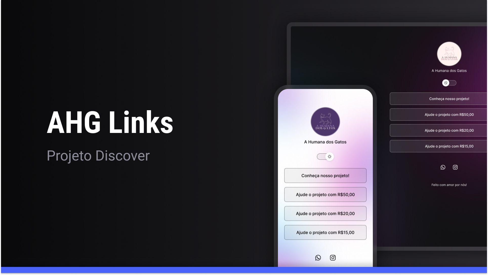

<h1 align="center"> AHG Links :cat: </h1>

Projeto realizado através do curso gratuito da RocketSeat

  <a href="#-tecnologias">Tecnologias</a>&nbsp;&nbsp;&nbsp;|&nbsp;&nbsp;&nbsp;
  <a href="#-projeto">Projeto</a>&nbsp;&nbsp;&nbsp;|&nbsp;&nbsp;&nbsp;
  <a href="#-layout">Layout</a>&nbsp;&nbsp;&nbsp;|&nbsp;&nbsp;&nbsp;
  <a href="#memo-licença">Licença</a>

  

 

  

## 🚀 Tecnologias

Esse projeto foi desenvolvido com as seguintes tecnologias:

- HTML e CSS
- JavaScript
- Git e Github
- Figma

## 💻 Projeto

O AHG Links é um agregador de links para usar como meio de informação online para o projeto AHG.

## :book: Aprendizados

Com esse projeto, aprendi não só como utilizar as tecnologias ditas acima, mas também a personalizar os códigos HTML e CSS e designs no Figma. Consegui utilizar esses conhecimentos para resolver problemas na prática, me levando a construir um projeto personalizado que atenda minha necessidade real.

## 🔖 Layout

Você pode visualizar o layout do projeto através [DESSE LINK](https://www.figma.com/file/uvcJe7ERr9hlxXZqTOX588/AHG-DRAFT?type=design&node-id=7%3A2&mode=design&t=MvQ9bvNIba745QmZ-1). É necessário ter conta no [Figma](https://figma.com) para acessá-lo.

## :memo: Licença

Esse projeto está sob a licença MIT.

---

Feito com ♥ por mim
